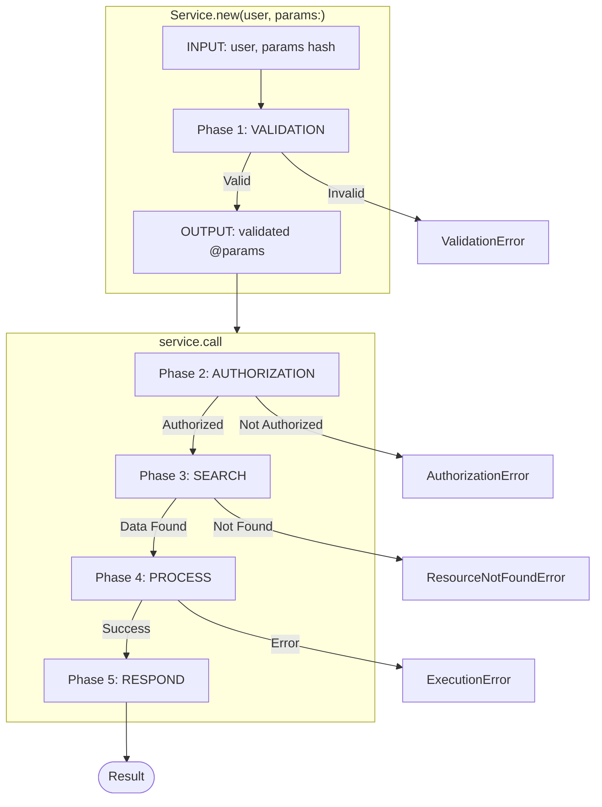
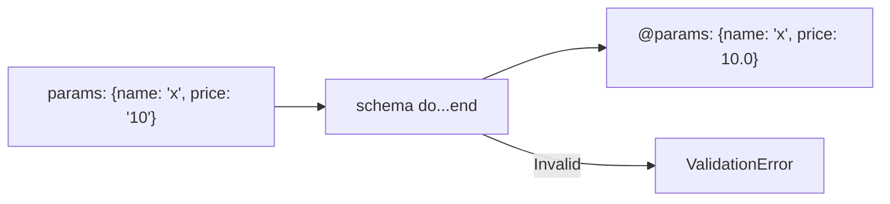
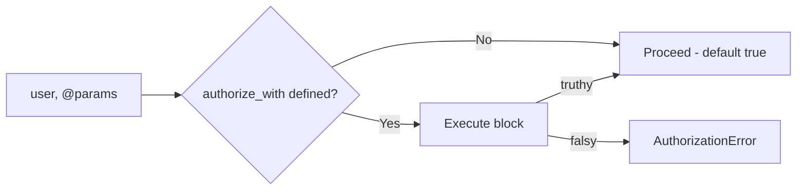
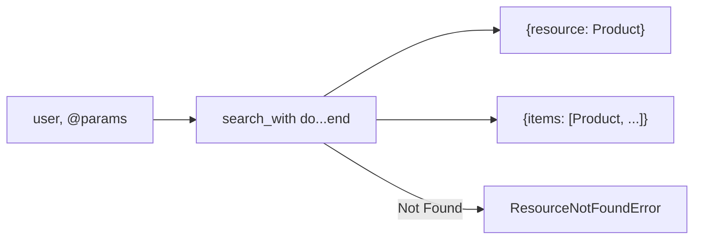
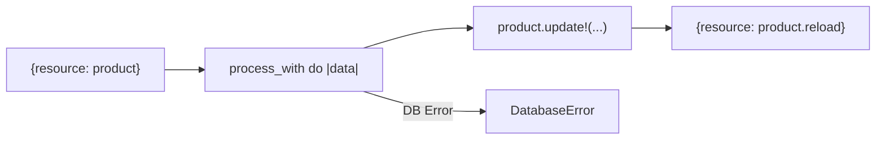
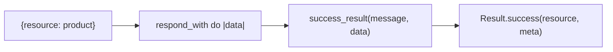
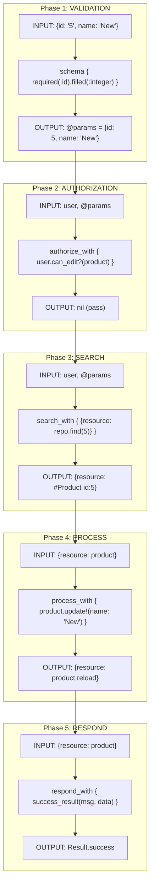
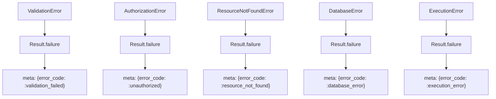

# Architecture Diagrams

Visual diagrams showing service execution flow with input/output for each phase.

---

## 5-Phase Service Flow

BetterService executes in **5 sequential phases**. Phase 1 runs during `initialize`, phases 2-5 run during `call`.



---

## Phase 1: VALIDATION

Runs during `Service.new(user, params:)` - validates and coerces parameters.

| Aspect | Details |
|--------|---------|
| **When** | During `Service.new(user, params:)` |
| **Input** | Raw `params` hash from caller |
| **Process** | Dry::Schema validation against `schema` block |
| **Output** | `@params` - validated, coerced hash |
| **On Error** | Raises `ValidationError` immediately |



### DSL

```ruby
schema do
  required(:name).filled(:string, min_size?: 2)
  required(:price).filled(:decimal, gt?: 0)
  optional(:published).maybe(:bool)
end
```

---

## Phase 2: AUTHORIZATION

Runs first in `call` - checks user permissions before any data access.

| Aspect | Details |
|--------|---------|
| **When** | First step of `call`, BEFORE search |
| **Input** | `user`, `@params` |
| **Process** | Execute `authorize_with` block (if defined) |
| **Output** | `nil` (pass-through, no data modification) |
| **On Error** | Raises `AuthorizationError` |
| **Default** | If `authorize_with` NOT defined → **implicitly authorized** |



### DSL

```ruby
# Optional - if not defined, authorization passes automatically
authorize_with do
  next true if user.admin?
  product = Product.find_by(id: params[:id])
  next false unless product
  product.user_id == user.id
end
```

### Default Behavior

If `authorize_with` is **NOT declared** in a service:
- No authorization check is performed
- The service proceeds directly to the Search phase
- Equivalent to always returning `true`

---

## Phase 3: SEARCH

Loads data required for business logic.

| Aspect | Details |
|--------|---------|
| **When** | After authorization passes |
| **Input** | `user`, `@params`, repositories |
| **Process** | Execute `search_with` block |
| **Output** | Hash with loaded data |
| **On Error** | Typically raises `ResourceNotFoundError` |



### DSL

```ruby
search_with do
  product = product_repository.find(params[:id])
  { resource: product }
rescue ActiveRecord::RecordNotFound
  raise BetterService::Errors::Runtime::ResourceNotFoundError.new(
    "Product not found",
    context: { id: params[:id] }
  )
end
```

### Output Convention

| Key | Usage |
|-----|-------|
| `{ resource: object }` | Single resource (Show, Update, Destroy) |
| `{ items: array }` | Collection (Index) |
| `{ }` | No data needed (Create) |

---

## Phase 4: PROCESS

Executes business logic and data transformations.

| Aspect | Details |
|--------|---------|
| **When** | After search completes |
| **Input** | `data` hash from search phase |
| **Process** | Execute `process_with` block |
| **Output** | Hash with transformed/created data |
| **On Error** | `DatabaseError`, `ExecutionError` |
| **Transaction** | Wrapped if `with_transaction true` |



### DSL

```ruby
process_with do |data|
  product = data[:resource]
  product_repository.update!(product, params.except(:id))
  { resource: product.reload }
end
```

### Transaction Support

```ruby
with_transaction true  # Wraps process phase in ActiveRecord::Base.transaction
```

---

## Phase 5: RESPOND

Formats the final response.

| Aspect | Details |
|--------|---------|
| **When** | After process completes |
| **Input** | `data` hash from process phase |
| **Process** | Execute `respond_with` block |
| **Output** | Final hash wrapped in `Result` object |
| **Presenter** | Transforms data if `presenter` defined |



### DSL

```ruby
respond_with do |data|
  success_result(message("update.success"), data)
end
```

### With Presenter

```ruby
presenter ProductPresenter  # Automatically wraps resource/items
```

---

## Complete Data Flow Example

End-to-end flow for an Update service.



---

## Error Flow

All errors are caught and wrapped in `Result.failure`.



---

## Quick Reference

| Phase | When | Input | Output | DSL |
|-------|------|-------|--------|-----|
| 1. Validation | `initialize` | raw params | `@params` | `schema do` |
| 2. Authorization | `call` start | user, params | nil | `authorize_with do` |
| 3. Search | after auth | user, params | `{resource:}` / `{items:}` | `search_with do` |
| 4. Process | after search | data hash | transformed data | `process_with do |data|` |
| 5. Respond | after process | data hash | `Result` | `respond_with do |data|` |
